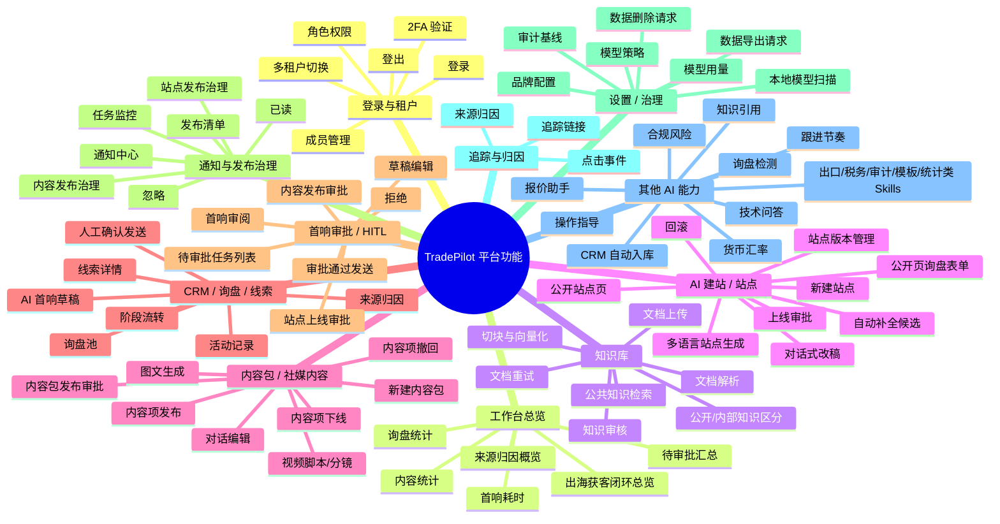

# TradePilot 功能清单思维导图

> 可直接编辑的 Mermaid mindmap。复制到支持 Mermaid 的 Markdown 预览器即可继续修改。

```mermaid
mindmap
  root((TradePilot 平台功能))
    登录与租户
      登录
      登出
      2FA 验证
      多租户切换
      成员管理
      角色权限
    工作台总览
      出海获客闭环总览
      询盘统计
      内容统计
      首响耗时
      待审批汇总
      来源归因概览
    知识库
      文档上传
      文档解析
      切块与向量化
      文档重试
      公共知识检索
      公开/内部知识区分
      知识审核
    AI 建站 / 站点
      新建站点
      对话式改稿
      多语言站点生成
      站点版本管理
      上线审批
      回滚
      自动补全候选
      公开站点页
      公开页询盘表单
    内容包 / 社媒内容
      新建内容包
      对话编辑
      图文生成
      视频脚本/分镜
      内容包发布审批
      内容项发布
      内容项下线
      内容项撤回
    CRM / 询盘 / 线索
      询盘池
      线索详情
      活动记录
      阶段流转
      来源归因
      AI 首响草稿
      人工确认发送
    首响审批 / HITL
      首响审阅
      草稿编辑
      拒绝
      审批通过发送
      站点上线审批
      内容发布审批
      待审批任务列表
    通知与发布治理
      通知中心
      已读
      忽略
      发布清单
      站点发布治理
      内容发布治理
      任务监控
    设置 / 治理
      品牌配置
      模型策略
      模型用量
      审计基线
      数据导出请求
      数据删除请求
      本地模型扫描
    追踪与归因
      追踪链接
      点击事件
      来源归因
    其他 AI 能力
      报价助手
      跟进节奏
      合规风险
      操作指导
      技术问答
      询盘检测
      知识引用
      CRM 自动入库
      货币汇率
      出口/税务/审计/模板/统计类 Skills
```

## 备注

- 这是按当前仓库实际路由和页面整理的功能树。
- 如果后续新增模块，优先补到对应一级节点下，不要另起一棵树。
- 如果要导出给产品或老板看，可以再拆成「业务版」「研发版」「验收版」三个版本。
